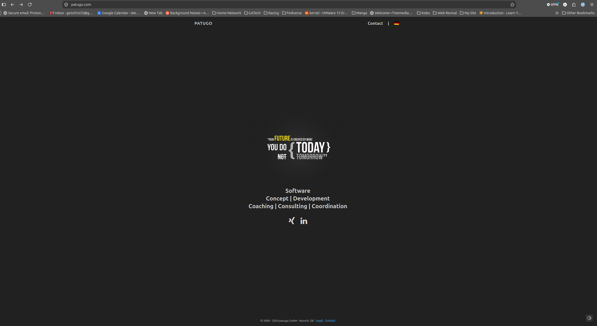

* CS6727 - Final Practicum
#+STARTUP: indent
:PROPERTIES:
:END:
** Final Project
*** Week 1 Tracking
**** Week 1 - Day 1
#+date: 2026-08-31
- Looked up how ot make a Firefox extension
  - [[https://developer.mozilla.org/en-US/docs/Mozilla/Add-ons/WebExtensions/Your_first_WebExtension][Mozilla - Your First Extension Tutorial]]
  - [[https://extensionworkshop.com/][Firefox Extension Workshop]]
  - [[https://www.sitepoint.com/create-firefox-add-on/][Sitepoint Tutorial]]
  - [[https://developer.mozilla.org/en-US/docs/Mozilla/Add-ons/WebExtensions][mdn - Browser Extensions]]
- Read and started working on the [[https://developer.mozilla.org/en-US/docs/Mozilla/Add-ons/WebExtensions/What_are_WebExtensions][mdn - Browser Extensions]] tutorial
  - Worked on the Browser Extension tutorial
    - [[file:~/Documents/borderify/][Borderify Example]]
  - Did the red border tutorial - all retyped by 
- Started reading and working ont he "Your Second Extension example".
  - [[file:~/Documents/beastify/][Beastify Example]]
**** Week 1 - Day 3
#+date: 2026-09-02
- Continued work on the Beastify Example
- Got the example done, but its not working quite right.
- Will come back at lunch and see if I can find the issue
**** Week 1 - Day 6
#+date: 2026-09-05
- Got back my feedback from previous submission
#+begin_quote
The topic is fine, but you need to look into the research literature for techniques that are relevant to the problem you want to address. Second, how exactly do you plan to detect if a result is safe or malicious? You need to provide some details to assess the feasibility and scope of the project. Finally, a serious concern is how you can evaluate the solution to demonstrate that it will actually help people like your mother. It may require a user study with experiments that you perform. It is less clear if you can develop a timeline that includes such an evaluation. Please address these questions and concerns as you revise the proposal.

Mustaque Ahamad
Sep 1 at 10:32am 
#+end_quote
***** Going to spend today researching potential solutions to how to identify the malicious links
- I am using AI assistance for my research, but I am being intentional about using it as a tool to help ME research, rather than using it to do the searching for me.
  - [[https://gemini.google.com/notebook/4ca8b1d0-4d87-4e1f-ac45-9ab763947b21][Google Gemini Chat Logs]]
****** Starting with good old Kagi search to get my bearings  :ideas:
- [[https://kagi.com/search?q=malvertising][Kagi Search - Malvertising]]
- https://www.malwarebytes.com/malvertising
  #+begin_quote from_article
  Malvertising is the use of online advertisements to spread malware or scams, sometimes without any user interaction.
  #+end_quote
  - Good intro article, nothing groundbreaking
  - [[https://www.malwarebytes.com/blog/news/2016/02/a-look-behind-the-skype-malvertising-campaign][Non-Search Engine Malvertising Example - Skype]]
- [[https://en.wikipedia.org/wiki/Malvertising][Wiki Page - Malvertising]]
  - This one cites a page that talks about the effectiveness of adblocksrs in stopping malvertising - [[https://web.archive.org/web/20160130161632/http://blog.check-and-secure.com/091015-malvertising-up-325-are-adblockers-working/][Malvertising up - Are the adblockers working?]]
- [[https://web.archive.org/web/20160130161632/http://blog.check-and-secure.com/091015-malvertising-up-325-are-adblockers-working/][Are the adblockers working (2015)]]
  - Very short but interesting article with some very good quotes.
    #+begin_quote
    In short, an AdBlocker – or any other program that actively blocks web content – will provide an element of protection against such threats, but nowhere close to a comprehensive protection.
    #+end_quote
  - Man, the product this talks about sounds just like what I was thinking of making
  - Well, this product does not seem to exist - at least now I get a 404 page -> [[https://patugo.com/cyscon-phishing-protection.html]]
    - No Idea what Patugo is, but that is where it redirects
    - 
    - Even used to have a firefox plug in, but also getting 404 now
      - [[https://phishkiller.com/en/cyscon-firefox-plugin/]]
- [[https://getblockify.com/blog/malvertising/][Blockify - Malvertising Overview]]
  - Mentions ClickFix (Potential direction to take research)  #idea
  - Also discusses Fake google ads and software impersonation
  - Has very good recommendations
    - Suggests using adblocker as front line defense
- [[https://www.confiant.com/hubfs/Team%20-%20Marketing/THE%20MAQ%20INDEX%202026_%20RISKY%20BUSINESS.pdf][Risky Business - Confiant 2025 report on malvertising]]
  #+begin_quote
  one in every 133 impressions was dangerous or highly disruptive to the end user
  #+end_quote
  - Maybe this could be addresses by looking at ads that redirect traffic, Idea would be that adversary has bought a legit domain and made it reputable in some way.  Then once ads start being served, the change it to serve up a redirect to a malicious site to the victim.  If a plugin checked for a redirect it could tell the user. #idea
  - Maybe we could alternatively just highlight the ads to more clearly denote them as ads.  #idea
  - Very good overview of the current state of the industry
- [[https://blog.confiant.com/p/sourtrade-browser-assembled-malware][Sour Trade - Confiant]]
  - Talks about a newer technique where the malware is built in memory rather than being dowloaded whole
- [[https://conscia.com/blog/from-seo-poisoning-to-malware-deployment-malvertising-campaign-uncovered/][Conscia writeup]]
  - Case study about another malvertising instance with a broken up payload
- [[https://android.gadgethacks.com/how-to/ad-blockers-that-still-work-in-chrome-4-ways-to-block-ads/][Gadget Hacks article about Chrome Blocking in 2026]]
  - Talks about how V3 was supposed to stop ad blockers from working, but seems to not have been as impactful as expected.
****** Now going to move onto looking for more academic resources using GATech library
******* IEEE Xplore
******** [[https://ieeexplore.ieee.org/document/8365356][Malvertising: A case study based on analysis of possible solutions]] - 2017
- Really a let down of an article.  Very vague and general, lots of typos and mistakes.
******** [[https://ieeexplore.ieee.org/document/9071175][SpartanShield: A Layered Defense against Malvertising]] - 2019 :ideas:
- Idea for how to measure success of product
- Really cool idea.  measuring effectiveness of Brave, PiHole, and uBlock Origin at blocking ads when bundled together
- Also has a really good reference page of other articles that look good, but are dated
******** [[https://ieeexplore.ieee.org/document/10936394][Malvertising in AI-Powered Chat Platforms: Utilizing Integrated Artificial Intelligence Solutions for Threat Detection and Mitigation]]
- Some overlap, interesting, but looks at malvertising specifically in AI banking chatbot output
- Also, mainly just a literature review
******** [[https://ieeexplore.ieee.org/document/10508033][Mitigating Malvertising Threats: An Exploration of Machine Learning Classification Algorithms for Effective Detection]] 
- Another lit review
******** [[https://ieeexplore.ieee.org/document/7996807][A game theoretic approach for inspecting web-based malvertising]] - 2019
- Interesting, but not super applicable to what Im doing
******** [[https://ieeexplore.ieee.org/document/8444673][A Bayesian Game Theoretic Approach for Inspecting Web-Based Malvertising]]
- Same authors as above, but with a Beysian Game
******** [[https://ieeexplore.ieee.org/document/7345447][Automated Collection and Analysis of Malware Disseminated via Online Advertising]] - 2015 :ideas:
- Really interesting and good article. Has a method of scanning for malvertising links that could be expanded upon
- Really good search terms for unearthing malicious ads on google
******** [[https://ieeexplore.ieee.org/document/6804827][A Malicious Advertising Detection Scheme Based on the Depth of URL Strategy]] - 2013
- Interesting, very chinese site focused
******* [[https://dl.acm.org/action/doSearch?AllField=Malvertising][ACM Explore - Malvertising]]
******** [[https://dl.acm.org/doi/pdf/10.1145/2663716.2663719][The Dark Alleys of Madison Avenue: Understanding Malicious Advertisements]] - 2014 :ideas:
- Interesting article, used 3 Oracles to determine if malicious, WePawEt, VirusTotal, and Domain Blacklists
- Potentially could use this same idea and repeat to see if there have been changes, OR do the same, but look specifically for clickFix
******** [[https://dl.acm.org/doi/pdf/10.1145/2736277.2741630][Understanding Malvertising Through Ad-Injecting Browser Extensions]]
- Built a tool called Expector that can scan chrome extensions to determine if malicious or not
******** [[https://dl.acm.org/doi/pdf/10.1145/2382196.2382267][Knowing Your Enemy: Understanding and Detecting Malicious Web Advertising]]
- Tool called MadTracer that uses Machine Learning to identify malicious sites
***** Reviewing requirements again, and AI usage rules  :ai:
- After reviewing I am using AI including for my brainstorming work today.  However, I am being very careful to use it as a helper and NOT to do the work for me.
- All logs are being preserved in a Google Gemini Notebook so that I can share if requested.
**** Week 1 - Day 7
***** Plan today is to continue my research and then move on to fill out my template
****** Not the most urgent thing, but I am a bit worried that if I try to run a script to get google search results Im gonna get rate limited.  Looking into that first.
- [[https://stackoverflow.com/questions/61074952/whats-the-rate-limit-of-google][Stack Overflow post about rate limiting]]
  - Says that I need to use the API
- [[https://developers.google.com/custom-search/v1/overview][Goolge Custom Search JSON API]]
  - No longer accepting new customers
  - has some new AI alternative that is not what I need
- Asked Google Gemini and it reccomends using a hird-party Search Engine Results Page (SERP).  Im gonna look into those now.
  - [[https://serper.dev/][Server.dev]] :: Looks pretty good $50 for 50k queries
  - [[https://www.scrapingdog.com/][Scrapingdog]] :: $40 for 200k Reqeusts Credits
  - [[https://adstransparency.google.com/?region=US][Google Ads Transperancy Center]] :: Only shows ads that were shown to me, but may be worth having
  - [[https://serpapi.com/][SeprAPI]] :: $75 for 5k searches
  - [[https://scrape.do][Scrape.do]] :: Confirmed with chat bot on site that it does grab ads, kind of expensive though
- Also looked into building a custom crawler using something like ~playwright-stealth~.
  - [[https://pypi.org/project/playwright-stealth/][Playwright-Stealth Docs]] :: says will only bypass the simpleist of detections methods, so not super promising
- [[https://sakshamanand.com/blog/clickfix-google-ads-discovery/][ClickFix investigation based on domain]] :: very interesting, could be a way to stear my research 
*** Week 2 Tracking
**** Week 2 - Day 4
:PROPERTIES:
:DATE:     2026-09-11
:END:
***** Step 1: determine best SERP for my needs
- Super informative site all about the parts of SERP's and how they source their info
  - Also has a lot of ideas for ways to get SERPs without a paid proxy
  - [[https://ahrefs.com/blog/serps/]]
- [[https://geekflare.com/guides/best-serp-api/][GeekFlare.com SERP Site]] :: Good comparison of multiple SERP products
  - SerpApi seems pretty good for my purposes
- [[https://serpapi.com/pricing][SerpApi]] :: Only concern with this one is it is on the more expensive side
- [[https://oxylabs.io/products/scraper-api/serp/google][Oxylabs]] :: Pay as you go -> $1.00/1k queries, also monthly plans
  - This one also offers residential proxies so potentially could kill two birds with one stone here
  - Took a second to look into the documentation while i was there and it looks pretty straightforward as well
****** Need to remember Speed is important to which SERP I pick as well
- [[https://serpapi.com/blog/who-has-the-fastest-google-search-api/][SerpAPI Speed Comparison]] :: Comes from a SERP provider so definitley a conflict of interest, but still useful
***** Step 2: determine the best residential proxy for my needs
- [[https://www.techradar.com/best/best-residential-proxy][TechRadar Proxy Comparison]]
- [[https://iproyal.com/#pricing][IPRoyal]] :: pricing page -> supposedly one of the cheapest out there
***** Step 3: Start working on coding the collector
- I think Im gonna go with Python for this, mainly because I have experience with it, and the speed bottleneck is gonna be waiting for results, not the code I write.
- Will need a github page.  First gonna double check if we were told we have to use a GATech github or soemthing
  - Nothing saying it has to be private or anything, gonna just make a repo and go
  - Actually, just realized, Im gonna have this project be in the folder as well.
  - New Git Repo set up and working
    - [[https://github.com/ChrisCHumphreys/practicum_2026]]
  - Well, everythign is set up, I guess Ill start with a simple python scritp that just grabs a single google result for now, then once Im getting good results, I can pivot to using the SERP
- [[https://robbmann.io/posts/2022-09-04-emacs-python/][Python Emacs Blog]] :: Really useful site with emacs tips for python.  Have a feelign I will use this a lot
- requests library working. Got my first pull back from google.  Saved in the output directory
  - gonna expirement a bit and see when I hit the limit
**** Week 2 - Day 5
***** Reviewing Videos of Group Members
****** Dylan Glass - Assest Aware Vulnerability
- Left comments suggesting a way to automate and make repeatable the "asset criticality" functionality he is going for
****** Rushabh R Jhaveri
- US Energy Infrastructure Project
- Problem: Energy Sector faces threat, but defenses are fragmented
- Wants to standardize this like PCI-DSS in payment systems
****** Anderw Schon - Context-Aware Security Assessment Tool for 3rd Party Windows Tools
- Unfortunately, I have no experience with single-annotator classification mechanisms, so don't have any feedback for that item.  Hope this feedback is helpful, looking forward to seeing your progress on this!
*** Week 4 Tracking
:PROPERTIES:
:DATE:     2026-09-14
:END:
**** Week 4 Day 1
***** Collector work continuing.
- Github repo is made and first few runs of just grabbing google pages seems to have been successful
- This whole week is making sure that this is complete, so gonna do that today
- Decided to go with OxyLabs, they have a free trail, so I will do that first and then decide if I want to keep them or not later.
